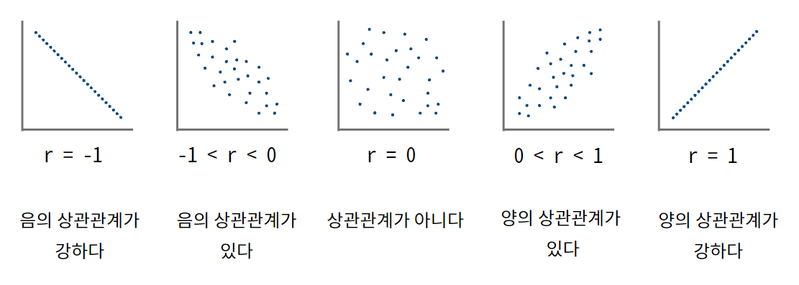
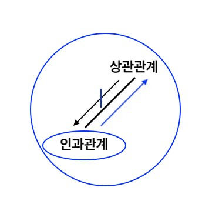

# 상관관계와 인과관계의 관계

### 상관관계란
* 서로 간의 통계적 연관성
* 상관계수(r)을 통해 상관관계를 정량화
 

### 인과관계란
* 인과(cause-of)는 원인에 의해 결과가 야기되는 관계
* 인과관계의 내포(반드시 지녀야 하는 속성)는 선후성, 상관성 비허위성
* 허위성 : 제3의 변수가 인과적 설명에 필요함
* 쉽게 말하면 내포는 필요조건이고, 위 세가지 속성은 인과관계가 되기 위한 필요조건으로 설명 됨

### 상관성이 인과관계의 필요조건이라면
* 서로 간의 포합관계가 성립
* 인과관계 --> 상관관계
 

### 상관관계와 인과관계를 혼동한다면
* 공통된 원인을 무시할 때 
: 아이스크림이 많이 팔린 날, 수영장에서 익사 사고가 많아졌다고 아이스크림이 익사의 원인이라고 해석해서는 안 된다. 제 3의 변수인 더위가 두 사건의 공통된 원인이기 때문이다. 마찬가지로 운동량은 질량과 속도의 결과이지만, 질량과 속도 사이에는 인과 관계가 존재하지 않는다.

* 공통된 효과가 존재할 때 
: 상관관계만으로 인과가 존재한다고 비약하는 일은 공통 효과가 있을 때도 일어난다. 
