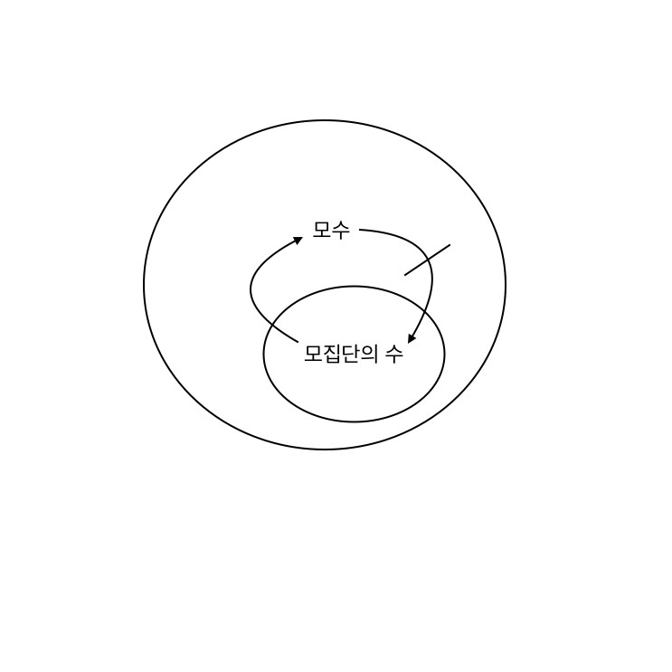

# 모수가 모집단의 수라고?

### 모수와 모집단의 수 사이에는 포함관계가 존재한다.(모수 =/= 모집단의 수)

### 모수란
* 모집단의 수치적 요약값
* 모집단의 수는 모수이지만, 모수가 모집단인 것은 아님
* 모평균, 모표준편차와 같은 모집단에 대한 통계값이 모수의 포함됨
* 모집단을 자체로하는 데이터 분석은 어렵기 때문에, 이러한 모수를 바탕으로 모집단을 추론해 사용함